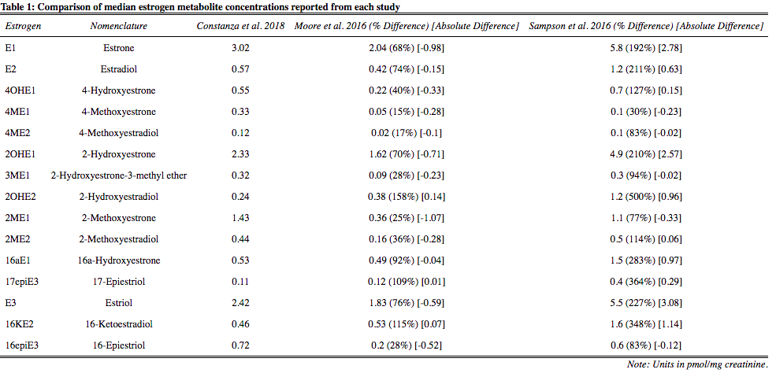

```{r setup, include=FALSE}
library(knitr)
knitr::opts_chunk$set(
	fig.path='figure/graphics-', cache.path='cache/graphics-', # sets folder for saving graphics
    fig.align='center',external=TRUE, warning=FALSE, # alligns figures to center, no print warnings
    fig.pos='H', table.placement='H', fig.height=12.5,  # makes tables and graphs in correct order with text
		fig.width=12.5,
	echo=FALSE, message=FALSE, cache=TRUE, #don't print code or messages, saves in cache
	warn.conflicts=F,  # don't print warnings 
	tidy=TRUE,tidy.opts=list(width.cutoff=60)) # makes printing code not run off page
				a4width<- 8.3
				a4height<- 9
```


```{r}
setwd("~/Desktop/nci_summer_project/project")
source("Supplemental/check_packages.R")
source("Supplemental/custom_cormatrix.R")  # use to load correlation matrix function
check_packages(c("ggthemes","optimx","metafor","stringr","Hmisc","ggpubr","scales","readxl","sas7bdat","readstata13","gridExtra","RColorBrewer","sjPlot","readr","stargazer","knitr", "grid","lme4","ggrepel","tidyr","networkD3","kableExtra","dplyr","ggplot2"))
load("data/cleaned_data.RDA")
```

\newpage

# Materials and Methods
## Study Design
```{r}
table = as.data.frame(read_xlsx("Supplemental/study_demographics_chart/demographics_read_in.xlsx"))
colnames(table) = c("",rep(c("Case","Control"),6))


kable(table, "latex", caption = "Demographics Table", booktabs = T) %>%
kable_styling(latex_options = c("scale_down","hold_position"),
	bootstrap_options = "condensed", full_width = F, position="center") %>%
  add_header_above(c(" ", "Iran" = 2, "Korea (KMCC)" = 2, "Germany" = 2,"Korea (SNU)"=2,"Japan"=2,"Overall"=2)) %>%
  add_header_above(c(" ", "Cohort" = 6, "Case Control" = 4," "=2)) %>%	
	footnote(c("NA = Data not available"))
#
```

Incident gastric cancer and two case-control studies of early-stage cancer were used for analysis. For the incident gastric cancer set, pre-diagnostic urine samples from all available postmenopausal (or age 60+ years) women diagnosed with gastric cancer and incidence-density matched controls from three prospective cohort studies (Golestan Cohort (Iran), Korean Multicenter Cancer Cohort, and ESTHER Cohort (Germany)) were tested. Iran and Korea (KMCC) were approximately 1:2 ratio of cases vs. controls. For the early-stage case-control gastric cancer set, urine samples from postmenopausal (or age 60+ years) women diagnosed with early-stage gastric cancer (AJCC clinical stages 1A [T1, N0, M0] or 1B [T1, N1, M0 or T2, N0, M0]) and 1:1 age-matched (+/- 5 years) controls from established case-control studies in Japan and Korea (Seoul Gastric Cancer Study) were tested. 

Postmenopausal women with gastric cancer were matched by age to gastric cancer-free controls. Women who ever used post-menopausal hormone replacement were excluded since we were specifically interested in the effects of endogenous estrogens. Premenopausal women were also excluded since estrogen levels vary over the menstrual cycle, greatly complicating interpretation of measurements; in any case, gastric cancer is rare prior to age 50 years. On the other hand, restriction of the case-control set to stage 1 gastric cancer will limit the risk of reverse causality.

Urine specimens were collected at enrollment in prospective studies and pre-treatment in case-control studies and continuously cryopreserved at -70/-80 degrees Celcius until analysis.

Variables considered for covariate adjustment to estimate odds ratio effect sizes in the analysis portion were age, BMI, smoking, alcohol, education, and if the subject's relative had gastric cancer. Categories were simplified into never or ever to account for differences in how each variable was recorded for each study. This avoided ambiguous temporality and count of substance use for variables such as smoking and alcohol. Dividing into only two categories also reduced extreme sample size sparsity problems such as educational degree. 


## Laboratory Assay
Stable isotope dilution liquid chromatography-tandem mass spectrometry (LC-TMS) was used at the NCI Laboratory of Proteomics and Analytical Technologies, MD to simultaneously measure the total concentration of 2 parent estrogens (estrone and estradiol) and 13 estrogen metabolites (2-hydroxyestrone, 2-methoxyestrone, 2-hydroxyestradiol, 2-methoxyestradiol, 2-hydroxyestrone-3-methyl ether, 4-hydroxyestrone, 4-methoxyestrone, 4-methoxyestradiol, 16$\alpha$-hydroxyestrone, 16-ketoestradiol, estriol, 17-epiestriol, and 16-epiestriol) in an aliquot of 500 $\mu$L urine assay for each participant. In urine, parent estrogens and their metabolites are present primarily in conjugated form. Estrogen concentrations in spot urine samples were normalized to creatinine levels in order to adjust for variation in urinary volume. 


# Results
## Covarying Relationships Between Metabolites

```{r, out.height = "250px",fig.cap="Estrogen metabolite hydroxylation pathway sankey diagram. Line thickness proportional to spearman correlations between substrates and products on hydroxylation pathways (2-OH, green; 4-OH, tan; 16-OH, pink), ranging from 0.06 to 0.67. 4-Hydroxyestradiol and 16a-Hydroxyestrone not shown due to extremely low concentrations."}

knitr::include_graphics('Graphs and Tables/sankey.png')
####
```

Correlations between metabolites were relatively equal throughout the pathways except for the 4-Hydroxylation pathway connection with the 4OHE1 metabolite. 4OHE1 may have weak correlations due to an artifact of lab mis-measurement (many NF values).

```{r, fig.height=12.5, fig.width=15, fig.cap="Metabolite correlation matrix. Redder regions indicate stronger positive correlations. Scatterplot and histogram on log scale."}
custom_cormatrix(df %>% select(estrogen_names),log.transform=TRUE,size=0.8)
```

The relationship between estrogen metabolites were computed using spearman correlations on log transformed concentrations. Spearman correlation was chosen to account for nonlinear relationships among the metabolites that are more resistant to outliers and influential points. Log transformations were used to better visualize the paired scatterplots due to highly skewed distributions. 

The histograms show that the estrogen metabolite concentration distributions were still highly right tail skewed even after log transformations. Extremely high outliers may be an artificial result of laboratory mis-measurement and should be cautioned to be use as true values. The correlation matrix shows that all estrogens were positively associated with each other with highly significant p-values, even after adjusting for bonferonni corrections of significance levels. In other words, an individual with higher levels of one metabolite will in general have higher levels of all other metabolites as well. The strongest correlation was among parent estrogens E1 and E2, which was expected. The lowess smooth curve regression line with span 2/3 (in dark blue on the scatterplot) shows that on the log scale, there did not appear to be any major nonlinear higher order interactions (i.e. relationships were mostly linear on the log scale). Thus analysis was conducted without inclusion of polynomial terms. The span parameter was chosen as a general rule of thumb to apply to all metabolites and may not necessarily produce the best residual sum of squares, although it summarizes the true shape of relationships decently well. 


## Batch Effect and Not Found Data

```{r,results='asis'}
# counts total NF across all estrogens per batch
a = df%>% select(batch.num,estrogen_names) %>%
	gather(estrogen,concentration,estrogen_names) %>% group_by(batch.num) %>%summarize('Total estrogen NF (n)'=sum(is.na(concentration)))

# counts total number of cases and controls per batch
b = df %>% select(batch.num,status) %>%  group_by(batch.num) %>%summarize('Cases (n)'=sum(status=="Case",na.rm=TRUE), 'Controls (n)' =sum(status=="Control",na.rm=TRUE))

# puts together total NF, counts of cases and controls, and labels study per batch
df %>% group_by(batch.num) %>% summarize(n=n()) %>% full_join(a,by="batch.num") %>% full_join(b,by="batch.num")%>%
	rename(Batch = batch.num) %>% 
	mutate(Study = c("Germany and Korea (KMCC)",rep("Korea (KMCC)",2), "Japan", rep("Iran",4), rep("Korea (SNU)",8))) %>%
	
stargazer(title = "Table of estrogen batch information", header = FALSE,
rownames = FALSE, type = "latex", single.row = TRUE, no.space = TRUE, digits=NA,
summary = FALSE, table.placement = "H",notes=c("Note: Sample sizes are after QC sample removal"))


```

Batch 3, 13, 14, 15, and 16 consisted of almost entirely controls; while batch 9, 10, 11, and 12 consisted of almost entirely cases. Since some batches tended to be significantly higher/lower than other batches (see QC graph), there may be evidence of a batch effect. In other words, differences for cases vs. controls in metabolite concentrations or lack thereof for Korea (KMCC) and Korea (SNU) may be artificial due to batch differences rather than a true association. 

In general, different batches had different number of NF values. The batches with the lowest number of NF values also were the batches with mostly controls (batch 3, 15, and 16). Thus, controls were more represented than planned. Secondly, batch 1 containing Germany had substantially higher NF values for metabolite concentrations. Thus, Germany was slightly more under-represented than planned. 


```{r,results='asis'}
# view number of NF=missing data
missing = sapply(df %>% select(estrogen_names, creatinine), function(x) sum(is.na(x))) %>% as.data.frame()
missing$variable = rownames(missing)
missing = missing %>% dplyr::rename(num_missing = ".") %>%
mutate(pct_missing = round(100*num_missing/nrow(df), 1)) %>%
select(variable, num_missing, pct_missing) %>% 
	rename('NF (n)' = num_missing, 'NF (%)' = pct_missing, Variable = variable)

stargazer(missing,title = "Table of values not found (NF) for metabolites and creatinine", header = FALSE,
rownames = FALSE, type = "latex", single.row = TRUE, no.space = TRUE, digits=NA,
summary = FALSE, table.placement = "H")
```


```{r, fig.height=1, fig.width=4, fig.cap="Distribution of NF percent among all metabolites. Vertical line indicates median."}

graph.df = missing  %>%rename(pct_missing = 'NF (%)') %>% filter(Variable != "creatinine") %>% mutate(pct_missing = pct_missing/100)

ggplot(graph.df , aes(pct_missing))+
	geom_density(fill="grey75")+
    scale_x_continuous("",breaks=seq(0,0.3,0.05),labels=scales::percent_format(accuracy = 1))+
	theme_classic()+
	geom_vline(xintercept=median(graph.df$pct_missing), linetype="dashed")+
	theme(axis.text.y=element_blank(),axis.ticks.y=element_blank(),
    	axis.text.x =  element_text(size=7.5,face="bold"))
#
```

The median percent of NF values for estrogen metabolites was about 5%, with 4OHE1 having the highest percentage of NF values. NF values for metabolites were caused by measurements not being identified as targeted peaks due to mis-alignment of co-eluding peaks and strong unsuppression from the LC-TMS device. The peaks could not be fully re-integrated nor enriched even after re-processing. NF values for creatinine were due to low sample volumes. The NF values were not imputed due to the unknown relationship that mis-measurement of the LC-TMS device had with the probability of of a measurement to be un-recorded. In other words, it could not be determined if the distribution of NFs were independent of laboratory procedures which would bias predicted results if true. Furthermore, even if assumptions hold true for imputation, prediction models were not accurate enough to distinguish concentrations between tertile level cutoffs for the NF values (best prediction models for each metabolite were at most 60-70% accuracy when predicting tertiles and mean absolute error higher than the difference between tertile cutpoints per estrogen when predicting absolute concentrations).

All estrogen batches were re-analyzed by the laboratory which allowed us to compare non-overlapping missing values. (i.e. NF for a sample in the first analysis but not the second analysis), which determined that NFs did not appear to be correlated with how high or low the concentrations were. NF values for a sample in both batch analysis could not be determined if the nature was due to being below the LLOD range or not. Thus, the standard approach of replacing all NF values with half lower limit of quantification (LLOQ) or lower limit of detection (LLOD) would be inappropriate. Since NF was determined to be independent of measured variables, (i.e. NF status had nothing to do with concentrations themselves) complete cases (i.e. removing all missing values) was used accordingly. Furthermore, since the nature of NFs could not be fully determined, using complete cases was the safest and simplest approach. However, it should be noted that results that are borderline significant at the $\alpha$=0.05 level may change if NF values were treated differently or corrected instead. Sensitivity analysis or "worst-case-scenario" imputation (i.e. replacing all NF values with all high values or all low values) is another option to be considered if the laboratory cannot amend accordingly.


## Quality Control (QC) Analysis

Laboratory personnel was blinded to the case-control status of sample donors. A quality control (QC) set of 20 masked duplicate samples plus 4 additional laboratory control replicates from subjects with high available volumes representative of all studies was performed. Coefficient of variation (CV) and intraclass correlation coefficient (ICC) was calculated for standardized estrogen metabolite concentrations for the QC samples to assess within- and between-batch variations for assay reliability. The formula used for ICC on the original and log scale was $\frac{\sigma^2_{bs}}{\sigma^2_{bs}+\sigma_{bb}+\sigma^2_{ws}}$, the formula used for CV on the original scale was $\frac{\sqrt{\sigma^2_{ws}+\sigma^2_{bb}}}{\mu}$, and the formula used for CV on the log scale was $e^{\sigma_{ws}}-1$; where $\sigma^2_{bs}$ = variance between subject, $\sigma^2_{bb}$ = variance between batch, and $\sigma^2_{ws}$ = variance within subject. The variance components were computed using a two stage multilevel model with varying intercept for ID and batch. Log transformations were necessary to adjust for high skew and large outliers to improve normality of distributions to meet assumptions necessary for the computation of variance which would otherwise lead to exaggerated variance components. 

NF values were treated as missing and were not included in calculations since any estimated numeric representations may give biased results. In other words, replacing missing values with expected values from a prediction model would favor a better reproducibility measurement). The lower limit of quantitation (LLOQ) for each analyte was 0.04 ng/mL. The median for each sample was well above the LLOQ and thus was not a major concern. However, samples with lower concentrations (i.e. postmenopausal sample) had higher measurement error since the measurement device is less sensitive at these levels. Thus, CV was also calculated for the post-menopausal sample by itself ; otherwise the ICC and CV measurements from mixing all four samples together would be a mis-representative measure of the study population of just postmenopausal women. 


### Laboratory Control QC Analysis
```{r,results='asis'}
qc.df1 = read_csv("data/qc_data/control.qc.csv") %>% 
	as.data.frame() %>%
  gather(Estrogen,Concentration,estrogen_names) %>%
  mutate(batch.num = as.factor(batch.num), ID = as.factor(ID))

qc_calculation = function(data){
   data %>%   group_by(Estrogen) %>%
	# log transformed data
	mutate(Concentration.l = log(Concentration)) %>%
  summarize(
  	# between subject variance 
  	s2_between_subject = VarCorr(lmer(Concentration ~ 1+ (1|ID) + (1|batch.num)))$ID[1],  
  	# between batch variance
    s2_between_batch = VarCorr(lmer(Concentration ~ 1+ (1|ID) + (1|batch.num)))$batch.num[1] ,   
  	# within subject variance
    s2_within_subject = (attr(VarCorr(lmer(Concentration ~ 1+ (1|ID) + (1|batch.num))), "sc"))^2,
  	# between subject variance log
  	s2_between_subject.l = VarCorr(lmer(Concentration.l ~ 1+ (1|ID) + (1|batch.num)))$ID[1],  
  	# between batch variance log
    s2_between_batch.l = VarCorr(lmer(Concentration.l ~ 1+ (1|ID) + (1|batch.num)))$batch.num[1] ,   
  	# within subject variance log
    s2_within_subject.l = (attr(VarCorr(lmer(Concentration.l ~ 1+ (1|ID) + (1|batch.num))),"sc"))^2 ,
  	# mean
    mean_concentration = mean(Concentration,na.rm=TRUE)) %>%
  mutate(
  	# computes ICC
  	ICC = 100*(s2_between_subject/(s2_between_subject+s2_within_subject+s2_between_batch)),
  	# computes ICC log
  	ICC.l = 100*(s2_between_subject.l/(s2_between_subject.l+s2_within_subject.l+s2_between_batch.l)),
  	# computes CV
    CV = 100*(sqrt(s2_within_subject + s2_between_batch)/mean_concentration),
  	# computes CV log
  	CV.l = 100*(exp(sqrt(s2_within_subject.l))-1)) %>%
	arrange(factor(Estrogen,levels=estrogen_names)) %>%
	select(Estrogen, s2_between_subject,s2_between_batch,s2_within_subject,mean_concentration,ICC,CV,
		s2_between_subject.l,s2_between_batch.l,s2_within_subject.l,ICC.l,CV.l)
}

qc.stats = qc_calculation(qc.df1)

kable(qc.stats, "latex", caption = "Laboratory control QC samples reproducibility calculations", booktabs = T,digits=1, col.names=c("Estrogen","$\\sigma^2_{bs}$","$\\sigma^2_{bb}$","$\\sigma^2_{ws}$","Mean","ICC","CV","$\\sigma^2_{bs}$","$\\sigma^2_{bb}$","$\\sigma^2_{ws}$","ICC","CV"), escape=F) %>%
  add_header_above(c(" ", "Original Scale" = 6, "Log Transformed" = 5)) %>%
kable_styling(latex_options = c("scale_down","hold_position"),
	bootstrap_options = "condensed", full_width = F, position="center") %>%
	footnote(c("bs = between subject, bb = between batch, ws = within subject","Units in pmol/mg creatinine"))
```

```{r, fig.height=3,fig.cap="Distribution of CV and ICC for all metabolites for laboratory control QC samples. Vertical line indicates median."}

graph.df = qc.stats %>%  rename('ICC (log)' = ICC.l, 'CV (log)'=CV.l) %>% gather(var1,var2,c(CV,ICC,'ICC (log)','CV (log)')) %>% mutate(var2 = var2/100)
graph.df2 = graph.df %>% group_by(var1) %>% summarize(median = median(var2))

ggplot(graph.df, aes(var2))+
	geom_density(aes(y=..scaled..),fill="grey75")+
    scale_x_continuous("",labels=scales::percent_format(accuracy = 1))+
	theme_classic()+
	ylab("Density")+
	geom_vline(data=graph.df2,aes(xintercept=median), linetype="dashed")+
		facet_wrap(~var1,ncol=2,nrow=2,scales="free")+
	theme(axis.text.y=element_blank(),axis.ticks.y=element_blank(),
    	strip.text.x = element_text(size = 15,face="bold"), 
    	axis.text.x =  element_text(size=10,face="bold"))

```


```{r, fig.height=8.5, fig.cap="Batch (x-axis) plotted against measured standardized concentrations."}
qc.df3 = qc.df1 %>% group_by() %>%mutate(Estrogen = factor(as.factor(Estrogen)), batch.num = as.numeric(as.character(batch.num)))

median.df = qc.df1 %>% group_by(ID,Estrogen) %>% summarize(med = median(Concentration,na.rm=TRUE)) %>%
		group_by() %>%mutate(Estrogen = factor(as.factor(Estrogen), levels=estrogen_names))
	
qc.df3 = qc.df3 %>% full_join(median.df,by=c("ID","Estrogen")) %>%
	mutate(Concentration=log(Concentration), med=log(med)) %>%
		mutate(Estrogen = factor(as.factor(Estrogen), levels=estrogen_names))

for (i in 1:nrow(qc.df3)){
	if (!(is.na(qc.df3$Concentration[i])) & qc.df3$Concentration[i] >=3) { 
		qc.df3$Concentration[i] = 3   
	}else if (!(is.na(qc.df3$Concentration[i])) & qc.df3$Concentration[i] <= -3){ 
		qc.df3$Concentration[i] = -3   
	}else if (is.na(qc.df3$Concentration[i]) & qc.df3$ID[i]=="A" ) { qc.df3$Concentration[i] =-4   
	}else if (is.na(qc.df3$Concentration[i]) & qc.df3$ID[i]=="B" ) { qc.df3$Concentration[i] =-4.1   
	}else if (is.na(qc.df3$Concentration[i]) & qc.df3$ID[i]=="D" ) { qc.df3$Concentration[i] =-4.2   
	}else if (is.na(qc.df3$Concentration[i]) & qc.df3$ID[i]=="E" ) { qc.df3$Concentration[i] =-4.3   
}
}


ggplot(qc.df3 %>% filter(Concentration >= -3),aes(x=batch.num,y=Concentration),  group = row.names(qc.df3)) +
  	geom_vline(xintercept=1:16,alpha=0.5,color="grey50",linetype="dotted")+
	geom_point(aes(color=ID), size=1.5,alpha=0.5)+
		geom_linerange(aes(color=ID,ymin=med,ymax=Concentration),alpha=0.5)+
		geom_point(data=qc.df3%>% filter(Concentration<=-4),aes(color=ID), size=1,alpha=0.7,shape=2)+
  theme_classic() +  
  scale_color_manual(values=c("Red","Green","Blue","Purple"),labels=c("Pre-Menopausal", "Post-Menopausal", "Pre-Menopausal","Male")) +	
	scale_y_continuous("Estrogen concentration (pmol/mg creatinine) log scale",breaks=seq(-4,3),limits=c(-5,3), labels=c("NF","<=-3",seq(-2,2),">=3"))+
	scale_x_continuous("Batch #",limits=c(1,16),breaks=seq(1,16))+
  	  geom_hline(aes(yintercept=med,color=ID), linetype="dashed",alpha=0.7)+
  facet_wrap(~ Estrogen,scales="free",ncol=5) +
  theme(legend.position="bottom",
  	  strip.text.x = element_text(size =12.5,face="bold"), 
        axis.text.y =  element_text(size=10, face="bold"))


```


The laboratory control QC samples consisted of 4 distinct urine sample types: 2 pre-menopausal (n=8 and 16), 1 post-menopausal (n=22), and 1 male urine (n=14), totaling 60 observations. In order to assess within and between variation, four samples were allocated within in each batch, some of which had duplicate sample types in the same batch. All laboratory control QC samples were removed when assessing the association between gastric cancer and estrogens.

Most metabolites had ICCs $\geq$ 60% with most CVs $\leq$ 60%, indicating moderate reproducibility generalizable across all batches. It should be noted that although 4OHE1 had a high ICC, it may be due to a low sample size and shouldn't be trusted (i.e. the only two samples representitive of sample B - postmenopausal were the samples with extreme concentrations that are most likely innaccurate). The QC samples plotted on the log scale illustrated that a few measurements for the same sample were many fold different than their counterparts. Two batches were specifically problematic, often having measurments many fold higher than other batches across different estrogens. Concentrations of these batches were not adjusted downwards since the sample size of QC samples in these batches were not sufficient enough for justification. Within subject variation was so significant that when concentrations were classified into tertiles, many replicates were in different tertile categories. 


### QC Sample Removal
```{r, out.height = "250px",fig.cap="Problematic QC samples highlighted for postmenopausal"}

knitr::include_graphics('Graphs and Tables/problem_qc.png')
```

```{r,results='asis'}
table = qc_calculation(qc.df1 %>% #filter(Concentration < 1000, batch.num != 12)) %>%
		filter(!(customer.id %in% c("Control_29","Control_30","Control_2","Control_13","Control_14")))) %>%
		select(Estrogen,ICC,CV,ICC.l,CV.l) %>% as.data.frame() 

stargazer(table, title = "Laboratory control QC samples reproducibility calculations", covariate.labels = c("Estrogen","ICC","CV","ICC (log)","CV (log)"),
rownames = FALSE, type = "latex", single.row = TRUE, no.space = TRUE, digits=1, header=FALSE,
summary = FALSE, table.placement = "H",notes="Note: QC sample 2, 13, 14, 29, 30 removed")
```

According to figure 5, the postmenopausal sample was the most problematic, specifically with batch 12 and batch 16. Figure 6 highlights the specific samples of batch 12 and 16 from postmenopausal QC sample to identify which samples were giving poor ICC and CV readings. These samples were removed from QC calculations to see how they affects ICC and CV. These two changes fixed the extreme skewness of the QC dataset and thus the ICC and CV on the original scale were much closer to that of the ICC and CV on the log scale. Using this adjustment, the ICC for 2OHE1 and 16epiE3 became over >85% compared to an ICC of 10% and 46% respectively before adjustment. The ICC and CV for other metabolites did not change much by this adjustment. It should be noted that removing extreme outliers and batches for the entire dataset is unjustifiable since there is not enough strong evidence to support this claim.

### Korea SNU QC Analysis
```{r,results='asis'}
qc.df2= read_csv("data/qc_data/snu.qc.csv") %>% 
	as.data.frame() %>% arrange(customer.id)%>%
  rename(ID = customer.id) %>%
  gather(Estrogen,Concentration,estrogen_names) %>%
  mutate(batch.num = as.factor(batch.num), ID = as.factor(ID))%>%
  group_by(Estrogen)

qc.stats = qc_calculation(qc.df2)


kable(qc.stats, "latex", caption = "Korea SNU QC samples reproducibility calculations", booktabs = T,digits=1, col.names=c("Estrogen","$\\sigma^2_{bs}$","$\\sigma^2_{bb}$","$\\sigma^2_{ws}$","Mean","ICC","CV","$\\sigma^2_{bs}$","$\\sigma^2_{bb}$","$\\sigma^2_{ws}$","ICC","CV"), escape=F) %>%
  add_header_above(c(" ", "Original Scale" = 6, "Log Transformed" = 5)) %>%
kable_styling(latex_options = c("scale_down","hold_position"),
	bootstrap_options = "condensed", full_width = F, position="center") %>%
	footnote(c("bs = between subject, bb = between batch, ws = within subject","Units in pmol/mg creatinine"))
```

```{r, fig.height=3, fig.cap="Distribution of CV and ICC for all metabolites for Korea SNU QC samples. Vertical line indicates median."}

graph.df = qc.stats %>%  rename('ICC (log)' = ICC.l, 'CV (log)'=CV.l) %>% gather(var1,var2,c(CV,ICC,'ICC (log)','CV (log)')) %>% mutate(var2 = var2/100)
graph.df2 = graph.df %>% group_by(var1) %>% summarize(median = median(var2))

ggplot(graph.df, aes(var2))+
	geom_density(aes(y=..scaled..),fill="grey75")+
    scale_x_continuous("",labels=scales::percent_format(accuracy = 1))+
	theme_classic()+
	ylab("Density")+
	geom_vline(data=graph.df2,aes(xintercept=median), linetype="dashed")+
		facet_wrap(~var1,ncol=2,nrow=2,scales="free")+
	theme(axis.text.y=element_blank(),axis.ticks.y=element_blank(),
    	strip.text.x = element_text(size = 15,face="bold"), 
    	axis.text.x =  element_text(size=10,face="bold"))
```

```{r, fig.height=8.5, fig.cap="19 Korea SNU QC sample IDs (x-axis) plotted against measured standardized concentrations. Batch identification indicated by color and shape."}
ggplot(qc.df2 %>% group_by() %>%mutate(Estrogen = factor(as.factor(Estrogen), levels=estrogen_names)),aes(x=ID,y=Concentration)) +
  geom_jitter(aes(color=batch.num,shape=batch.num),size=3,alpha=0.7, width=0.2,height=0,show_guide = TRUE) +
  scale_shape_manual(values=1:nlevels(qc.df2$batch.num))+
  theme_classic() +  
	geom_vline(xintercept=1:19,color="grey50",linetype="dotted" )+
  scale_y_log10("Estrogen concentration (pmol/mg creatinine)")	+
  xlab("ID") + 
  facet_wrap(~ Estrogen,scales="free",ncol=5) +
  theme(strip.text.x = element_text(size =12.5,face="bold"), 
  	    axis.text.x=element_blank(),
        axis.text.y =  element_text(size=10, face="bold"))

```


The Korea SNU replicates consisted of 19 unique samples each with two measurements that were either both in the same batch or across different batches, totaling 38 observations. One sample from each duplicate was randomly kept while the other pair removed when assessing the association between gastric cancer and estrogens. Most metabolites had ICCs $\geq$ 50% with most CVs $\leq$ 60%, indicating moderately inconsistent measurements. Replication results for Korea SNU duplicates was worse than over all batches assessed with laboratory control samples. Many measurements for the same sample were many fold different than their counterparts. Thus, it should be noted that metabolite measurements for Korea SNU may not be reproducible and caution is advised.


### Combined QC Analysis
```{r,results='asis'}
a = qc.df1 %>% select(batch.num,ID,Estrogen,Concentration)
b = qc.df2 %>% select(batch.num,ID,Estrogen,Concentration)

qc.stats = qc_calculation(bind_rows(a,b)) 

kable(qc.stats, "latex", caption = "Combined Laboratory QC and Korea SNU QC samples reproducibility calculations", booktabs = T,digits=1, col.names=c("Estrogen","$\\sigma^2_{bs}$","$\\sigma^2_{bb}$","$\\sigma^2_{ws}$","Mean","ICC","CV","$\\sigma^2_{bs}$","$\\sigma^2_{bb}$","$\\sigma^2_{ws}$","ICC","CV"), escape=F) %>%
  add_header_above(c(" ", "Original Scale" = 6, "Log Transformed" = 5)) %>%
kable_styling(latex_options = c("scale_down","hold_position"),
	bootstrap_options = "condensed", full_width = F, position="center") %>%
	footnote(c("bs = between subject, bb = between batch, ws = within subject","Units in pmol/mg creatinine"))
```

```{r, fig.height=3, fig.cap="Distribution of CV and ICC for all metabolites for combined QC samples. Vertical line indicates median."}
graph.df = qc.stats %>%  rename('ICC (log)' = ICC.l, 'CV (log)'=CV.l) %>% gather(var1,var2,c(CV,ICC,'ICC (log)','CV (log)')) %>% mutate(var2 = var2/100)
graph.df2 = graph.df %>% group_by(var1) %>% summarize(median = median(var2))

ggplot(graph.df, aes(var2))+
	geom_density(aes(y=..scaled..),fill="grey75")+
    scale_x_continuous("",labels=scales::percent_format(accuracy = 1))+
	theme_classic()+
	ylab("Density")+
	geom_vline(data=graph.df2,aes(xintercept=median), linetype="dashed")+
		facet_wrap(~var1,ncol=2,nrow=2,scales="free")+
	theme(axis.text.y=element_blank(),axis.ticks.y=element_blank(),
    	strip.text.x = element_text(size = 15,face="bold"), 
    	axis.text.x =  element_text(size=10,face="bold"))
```


## Assessing Association between Covariates and Gastric Cancer
```{r,fig.height=5}
data = df %>% select(status,age, bmi, education, alcohol, smoking, relativegc, origin)

p1 = ggplot(data, aes(status,age))+
	geom_boxplot(fill="grey75") +
	stat_compare_means(method="t.test",na.rm=TRUE,paired=FALSE,label.x=0.75)+
	theme_classic()+
	xlab("") +
		theme(axis.text.x =  element_text(size=10,face="bold"))

p2 = ggplot(data, aes(status,bmi))+
	geom_boxplot(fill="grey75") +
	stat_compare_means(method="wilcox.test",na.rm=TRUE,paired=FALSE,label.x=0.75)+
	theme_classic()+
	xlab("")+
		theme(axis.text.x =  element_text(size=10,face="bold"))

p3 = ggplot(data %>% filter(education != "9999") %>% filter(!(is.na(education))), aes(status))+
	geom_bar(aes(fill=education),position="fill",color="black") +
	scale_fill_grey("",start=0.6, labels=c("Never","Ever") )+
	theme_classic()+
	scale_y_continuous("Education",labels=scales::percent)+
	xlab("")+
		theme(axis.text.x =  element_text(size=10,face="bold"))

p4 = ggplot(data %>% filter(alcohol != "9999") %>% filter(!(is.na(alcohol))), aes(status))+
	geom_bar(aes(fill=alcohol),position="fill",color="black") +
	scale_fill_grey("",start=0.6, labels=c("Never","Ever") )+
	theme_classic()+
	scale_y_continuous("Alcohol",labels=scales::percent)+
	xlab("")+
		theme(axis.text.x =  element_text(size=10,face="bold"))

p5 = ggplot(data %>% filter(smoking != "9999") %>% filter(!(is.na(smoking))), aes(status))+
	geom_bar(aes(fill=smoking),position="fill",color="black") +
	scale_fill_grey("",start=0.6, labels=c("Never","Ever") )+
	theme_classic()+
	scale_y_continuous("Smoking",labels=scales::percent)+
	xlab("")+
		theme(axis.text.x =  element_text(size=10,face="bold"))

p6 = ggplot(data %>% filter(relativegc != "9999") %>% filter(!(is.na(relativegc))), aes(status))+
	geom_bar(aes(fill=relativegc),position="fill",color="black") +
	scale_fill_grey("",start=0.6, labels=c("Never","Ever") )+
	theme_classic()+
	scale_y_continuous("Relative w/ GC",labels=scales::percent)+
	xlab("")+
		theme(axis.text.x =  element_text(size=10,face="bold"))

ggarrange(p1,p2,p3,p4,p5,p6,nrow=1,ncol=6,widths=rep(0.5,6), common.legend=TRUE,legend=c("bottom"))
```

Cases were on average an older age while controls had a higher BMI on aveage. Other covariates of education, alcohol, smoking, and relative with gastric cancer did not have major differences in distribution between cases and controls. Thus, it is expected that adjusting for age and BMI in the logistic model will ultimately reduce the effect size of the metabolite than if the metabolite was used in the model itself as a main effect. However, adjusting for other covariates should not affect the metabolite estimated effect size significantly, but may inflate variance if samples in one group are sparse. Since adjusting for these other covariates should theoretically have effect sizes approximately centered to the same degree as not adjusting for these covariates, it is justifiable to remove certain covariates from each study model to optimize the bias-variance tradeoff.

## Assessing Association between Estrogens and Gastric Cancer

```{r,fig.cap="Study specific Wilcoxon-Mann-Whitney tests for cases vs. controls"}
###################################
boxplot.df = df %>% select(estrogen_names, origin,status) %>% filter(!(is.na(status))) %>%
  gather(Estrogen,Concentration,1:15)%>% 
  mutate(Estrogen = factor(as.factor(Estrogen),levels = estrogen_names),status=as.factor(status),
  	origin = factor(as.factor(origin),levels=country_list))

estrogen_max = boxplot.df %>% group_by(Estrogen) %>% summarize(max = max(Concentration,na.rm=TRUE)) %>% 
  mutate(Estrogen = factor(as.factor(Estrogen), levels=estrogen_names))

blank = data.frame(Estrogen = rep(estrogen_max$Estrogen,2), x=0,y=c(0-estrogen_max$max/15,7*estrogen_max$max)) %>% arrange(Estrogen)

boxplot.output = ggplot(boxplot.df, aes(x=origin,y=Concentration, fill=status)) +
  geom_boxplot(color="black") +
		scale_fill_grey(start=0.6)+
	  scale_y_log10(breaks = scales::trans_breaks("log10", function(x) 10^x),labels = scales::trans_format("log10", scales::math_format(10^.x))) +
  theme_bw() +
	facet_wrap(~ Estrogen, scales="free",ncol=5) +
  stat_compare_means(aes(group = status), method="wilcox.test", label= "p.signif",hide.ns=TRUE) +
  xlab("")+
  ylab("Concentration (pmol/mg creatinine)")+
	  geom_blank(data = blank, aes(x = x, y = y,fill=NULL))+
    theme(
    	strip.text.x = element_text(size = 10,face="bold"), 
    	axis.text.x =  element_text(size=7,face="bold",angle=23,hjust=1), 
    	axis.text.y =  element_text(size=7,face="bold"), 
    	legend.title=element_blank(),
    	legend.position="bottom")

ggsave(file.path("Graphs and Tables", "boxplot.output.png"),
             boxplot.output, width=7.5, height=7)

knitr::include_graphics('Graphs and Tables/boxplot.output.png')
```

Postmenopausal women with gastric cancer was compared with controls for both pre-diagnostic and early-stage case-control sample sets. Each study was analyzed seperately to account for differences in the relationship between estrogens and gastric cancer by country of origin and study type. Each of the estrogen markers were separately analyzed to assess an association with gastric cancer. Wilcoxon-Mann-Whitney (also known as Mann-Whitney U) test was used to compare estrogen marker concentrations as a continuous value between cases and controls. Significance levels are indicated by stars above boxplots ($*: p\leq0.05, **: p\leq0.01, ***: p\leq0.001, ****: p\leq0.0001$). According to the boxplot comparisons, over half of the metabolites had cases that had significantly higher concentrations for cases than controls at the $\alpha$=0.05 level for Korea SNU. However, the three metabolites that were significant for Korea KMCC (4ME2, 17epiE3, 16epiE3) showed the opposite association (i.e. controls had significantly higher levels of these metabolites compared to cases). Since Korea SNU was significant for parent estrogen E1, adjusting for E1 when performing logistic regression for this study may be appropriate since all other metabolites come from parent estrogens (i.e. other metabolites may be significantly associated with gastric cancer simply due to the fact that it was derived from the parent estrogen which is also significantly associated with gastric cancer).


```{r,results='asis'}
table = list()
for (i in 1:length(country_list)){
table[[i]] = df %>% filter(status=="Control") %>% select(origin,estrogen_names) %>% 
	gather(Estrogen,Concentration,estrogen_names) %>% 
	filter(origin==country_list[i])%>%
	group_by(origin,Estrogen) %>%
	summarize(var1 = paste0(round(median(Concentration,na.rm=TRUE),2), " (",
		round(quantile(Concentration, probs=1/3, na.rm=TRUE, names=FALSE),2),", ",
		round(quantile(Concentration, probs=2/3, na.rm=TRUE, names=FALSE),2),
		")")) %>%
	arrange(factor(origin, levels = country_list))
		
}
table = bind_cols(table) %>% group_by()%>%
	select(-contains("origin")) %>% arrange(factor(Estrogen,levels=estrogen_names)) %>%
	select(-contains("Estrogen"))

rownames(table) = estrogen_names_long
colnames(table) = rep("Median (Tertile)",5)


kable(table, "latex", caption = "Estrogen concentration median and tertile cutpoint", booktabs = T) %>%
	add_header_above(c("","Iran", "Korea (KMCC)","Germany","Korea (SNU)","Japan")) %>%
  add_header_above(c(" ", "Cohort" = 3, "Case Control" = 2)) %>%
kable_styling(latex_options = c("scale_down","hold_position")) %>%
	footnote(c("Tertile (33% and 66% quantiles) determined by control subjects","Units in pmol/mg creatinine"))
```

Study-specific estrogen marker tertiles were defined by the concentration distribution in controls to account for the extremely skewed distributions and improve interpretability. Tertile categories were treated as a numeric entry rather than a factor type to assess overall linear associations (i.e. $\beta$ coefficient for metabolite markers interpreted as risk difference from one tertile to the next). Since reproducibility was poor, it may be worth increasing the number of quantiles to quartiles such that variance of measurement will not have such drastic changes on categorization. Finer tuning into smaller categories would not restrict the measurement to be placed in the extreme low or high end. However, due to small sample size of some studies, this may not be a plausible approach. Korea SNU appeared to have lower estrogen concentrations than other studies, especially for the metabolites with high concentrations overall (E1, 2OHE1, E3). 


```{r}
# Meta analysis random effect where estrogen tertile is numeric 
# random effect adjused for age
country.df = list()
model1.coef= list()

for (j in 1:5){  # change to 1:5
country.df[[j]] = df %>% filter(origin==country_list[j]) %>% select(origin,case,t.estrogen_names,age,bmi,alcohol,smoking,relativegc,education)  
model1.coef[[j]] = data.frame(origin=country_list[j],estrogen = c(estrogen_names),estimate=rep(NA,15), variance=rep(NA,15), lower = rep(NA,15), upper = rep(NA,15))

if (j==3){ range=c(1,2,4:15)} else{ range=1:15  }

 for (k in range){
 model = summary(glm(as.formula(paste0("case", " ~ ", (paste(t.estrogen_names[k], "age", sep="+")))), data=country.df[[j]],  family=binomial(link="logit")))$coef
 model1.coef[[j]]$estimate[k] = model[2,1]
 model1.coef[[j]]$variance[k] = (model[2,2])^2
 model1.coef[[j]]$lower[k] = model[2,1]-1.96*model[2,2]
 model1.coef[[j]]$upper[k] = model[2,1]+1.96*model[2,2]
 }
}
model1.coef = bind_rows(model1.coef) %>% mutate(variance = ifelse(variance>1000,NA,variance))

meta.model1.coef.cohort = data.frame(origin="Cohort Random Effect",estrogen = estrogen_names,estimate=rep(NA,15), variance=rep(NA,15),lower = rep(NA,15), upper = rep(NA,15))
# for cohort
for (i in 1:15){
data = model1.coef %>% filter(origin %in% c("Germany", "Korea (KMCC)","Iran")) %>%filter(estrogen==estrogen_names[i])
model = rma(yi=data$estimate,vi=data$variance,method="REML")   # random effect model meta analysis
meta.model1.coef.cohort$estimate[i] = coef(model)
meta.model1.coef.cohort$variance[i] = (model$se)^2
meta.model1.coef.cohort$lower[i] = meta.model1.coef.cohort$estimate[i] - 1.96*model$se
meta.model1.coef.cohort$upper[i] = meta.model1.coef.cohort$estimate[i] + 1.96*model$se
}

meta.model1.coef.casecontrol = data.frame(origin="Case Control Random Effect",estrogen = estrogen_names,estimate=rep(NA,15), variance=rep(NA,15),lower = rep(NA,15), upper = rep(NA,15))
# for case control
for (i in 1:15){
data = model1.coef %>% filter(origin %in% c("Japan", "Korea (SNU)")) %>%filter(estrogen==estrogen_names[i])
model = rma(yi=data$estimate,vi=data$variance,method="REML")   # random effect model meta analysis
meta.model1.coef.casecontrol$estimate[i] = coef(model)
meta.model1.coef.casecontrol$variance[i] = (model$se)^2
meta.model1.coef.casecontrol$lower[i] = meta.model1.coef.casecontrol$estimate[i] - 1.96*model$se
meta.model1.coef.casecontrol$upper[i] = meta.model1.coef.casecontrol$estimate[i] + 1.96*model$se
}


RE.model1.combined = bind_rows(meta.model1.coef.cohort,meta.model1.coef.casecontrol)
meta.model1.coef = data.frame(origin="Overall Random Effect",estrogen = estrogen_names,estimate=rep(NA,15), variance=rep(NA,15),lower = rep(NA,15), upper = rep(NA,15))
# combined cohort and case control
for (i in 1:15){
data = model1.coef %>%filter(estrogen==estrogen_names[i])
model = rma(yi=data$estimate,vi=data$variance,method="REML")   # random effect model meta analysis
meta.model1.coef$estimate[i] = coef(model)
meta.model1.coef$variance[i] = (model$se)^2
meta.model1.coef$lower[i] = meta.model1.coef$estimate[i] - 1.96*model$se
meta.model1.coef$upper[i] = meta.model1.coef$estimate[i] + 1.96*model$se
}

RE.model1 = bind_rows(RE.model1.combined,meta.model1.coef)
RE.model1$model = "Age (Baseline)"


#########################################################################################################
# full model

country.df = list()
model3.coef= list()
for (j in 1:5){ 
country.df[[j]] = df %>% filter(origin==country_list[j]) %>% select(origin,case,t.estrogen_names,age,bmi,alcohol,smoking,relativegc,education)
model3.coef[[j]] = data.frame(origin=country_list[j],estrogen = c(estrogen_names),estimate=rep(NA,15), variance=rep(NA,15), lower = rep(NA,15), upper = rep(NA,15))


if (j==3){ # for germany
 for (k in c(1,2,4:15)){
  model = summary(glm(as.formula(paste0("case", " ~ ", (paste(t.estrogen_names[k], "age","bmi", sep="+")))), data=country.df[[j]],  family=binomial(link="logit")))$coef
  
  model3.coef[[j]]$estimate[k] = model[2,1]
 model3.coef[[j]]$variance[k] = (model[2,2])^2
 model3.coef[[j]]$lower[k] = model[2,1]-1.96*model[2,2]
 model3.coef[[j]]$upper[k] = model[2,1]+1.96*model[2,2]
 }
  } else if (j==5){ # for japan
  for (k in 1:15){
  model = summary(glm(as.formula(paste0("case", " ~ ", (paste(t.estrogen_names[k], "age","bmi","relativegc", sep="+")))), data=country.df[[j]],  family=binomial(link="logit")))$coef
  
   model3.coef[[j]]$estimate[k] = model[2,1]
 model3.coef[[j]]$variance[k] = (model[2,2])^2
 model3.coef[[j]]$lower[k] = model[2,1]-1.96*model[2,2]
 model3.coef[[j]]$upper[k] = model[2,1]+1.96*model[2,2]
  }
 } else if (j==2){ # for korea (KMCC)
 	  for (k in 1:15){
  model = summary(glm(as.formula(paste0("case", " ~ ", (paste(t.estrogen_names[k], "age","smoking","bmi","education", sep="+")))), data=country.df[[j]],  family=binomial(link="logit")))$coef
  
   model3.coef[[j]]$estimate[k] = model[2,1]
 model3.coef[[j]]$variance[k] = (model[2,2])^2
 model3.coef[[j]]$lower[k] = model[2,1]-1.96*model[2,2]
 model3.coef[[j]]$upper[k] = model[2,1]+1.96*model[2,2]
  }
 } else if (j==1){ # for iran
  for (k in 1:15){
  model = summary(glm(as.formula(paste0("case", " ~ ", (paste(t.estrogen_names[k], "age","bmi","education", sep="+")))), data=country.df[[j]],  family=binomial(link="logit")))$coef
 
   model3.coef[[j]]$estimate[k] = model[2,1]
 model3.coef[[j]]$variance[k] = (model[2,2])^2
 model3.coef[[j]]$lower[k] = model[2,1]-1.96*model[2,2]
 model3.coef[[j]]$upper[k] = model[2,1]+1.96*model[2,2]
   }
 } else if (j==4){ # for korea snu
  for (k in 1:15){
  model = summary(glm(as.formula(paste0("case", " ~ ", (paste(t.estrogen_names[k], "age","smoking","bmi","education","relativegc", sep="+")))), data=country.df[[j]],  family=binomial(link="logit")))$coef
  
   model3.coef[[j]]$estimate[k] = model[2,1]
 model3.coef[[j]]$variance[k] = (model[2,2])^2
 model3.coef[[j]]$lower[k] = model[2,1]-1.96*model[2,2]
 model3.coef[[j]]$upper[k] = model[2,1]+1.96*model[2,2]
  }
 }
 }

model3.coef = bind_rows(model3.coef) %>% mutate(variance = ifelse(variance>1000,NA,variance))

meta.model3.coef.cohort = data.frame(origin="Cohort Random Effect",estrogen = estrogen_names,estimate=rep(NA,15), variance=rep(NA,15),lower = rep(NA,15), upper = rep(NA,15))
# for cohort
for (i in 1:15){
data = model3.coef %>% filter(origin %in% c("Germany", "Korea (KMCC)","Iran")) %>%filter(estrogen==estrogen_names[i])
model = rma(yi=data$estimate,vi=data$variance,method="REML")   # random effect model meta analysis
meta.model3.coef.cohort$estimate[i] = coef(model)
meta.model3.coef.cohort$variance[i] = (model$se)^2
meta.model3.coef.cohort$lower[i] = meta.model3.coef.cohort$estimate[i] - 1.96*model$se
meta.model3.coef.cohort$upper[i] = meta.model3.coef.cohort$estimate[i] + 1.96*model$se
}

meta.model3.coef.casecontrol = data.frame(origin="Case Control Random Effect",estrogen = estrogen_names,estimate=rep(NA,15), variance=rep(NA,15),lower = rep(NA,15), upper = rep(NA,15))
# for case control
for (i in 1:15){
data = model3.coef %>% filter(origin %in% c("Japan", "Korea (SNU)")) %>%filter(estrogen==estrogen_names[i])
model = rma(yi=data$estimate,vi=data$variance,method="REML")   # random effect model meta analysis
meta.model3.coef.casecontrol$estimate[i] = coef(model)
meta.model3.coef.casecontrol$variance[i] = (model$se)^2
meta.model3.coef.casecontrol$lower[i] = meta.model3.coef.casecontrol$estimate[i] - 1.96*model$se
meta.model3.coef.casecontrol$upper[i] = meta.model3.coef.casecontrol$estimate[i] + 1.96*model$se
}


RE.model3.combined = bind_rows(meta.model3.coef.cohort,meta.model3.coef.casecontrol)
meta.model3.coef = data.frame(origin="Overall Random Effect",estrogen = estrogen_names,estimate=rep(NA,15), variance=rep(NA,15),lower = rep(NA,15), upper = rep(NA,15))
# combined cohort and case control
for (i in 1:15){
data = model3.coef %>%filter(estrogen==estrogen_names[i])
model = rma(yi=data$estimate,vi=data$variance,method="REML")   # random effect model meta analysis
meta.model3.coef$estimate[i] = coef(model)
meta.model3.coef$variance[i] = (model$se)^2
meta.model3.coef$lower[i] = meta.model3.coef$estimate[i] - 1.96*model$se
meta.model3.coef$upper[i] = meta.model3.coef$estimate[i] + 1.96*model$se
}

RE.model3 = bind_rows(RE.model3.combined,meta.model3.coef)
RE.model3$model = "Full Adjustment"


#########################################################################################################
# combinig all data

RE.model = bind_rows(RE.model1, RE.model3) %>% 
  rename(Estrogen  = estrogen) %>%
  full_join(estrogen_names_df,by="Estrogen") %>%
  mutate(Estrogen = factor(as.factor(Estrogen), levels=estrogen_names),
         Nomenclature = factor(as.factor(Nomenclature), levels=estrogen_names_long2),
         model = factor(as.factor(model), levels= rev(c("Age (Baseline)", "Full Adjustment"))),
         origin = factor(as.factor(origin), levels = rev(c("Cohort Random Effect", "Case Control Random Effect", "Overall Random Effect"))))
# exponentiate
RE.model[,3:6] = sapply(RE.model[,3:6], exp)

```

```{r,fig.height=7,fig.cap="Study specific pooled random effect logistic model"}
#########################################################################################################
plot1 = ggplot(data = RE.model %>% filter(model == "Age (Baseline)"), aes(x = origin,y = estimate))+
	  #geom_hline(yintercept =1, linetype="dotted",size=1.5)+
	 geom_hline(yintercept =1)+
    geom_pointrange(aes(ymin = lower, ymax = upper, col=origin),size=0.5)+
  geom_errorbar(aes(ymin=lower, ymax=upper,col=origin),width=0.5,cex=0.75)+   
      ylab("Odds Ratio (95% CI)")+
       scale_y_log10(breaks = c(0.25,0.5,1,1.5,2,3,5,7,9), labels=c(0.25,0.5,1,1.5,2,3,5,7,9))+
      theme_blank()+
 scale_color_grey(labels = c("Overall Random Effect","Case Control Random Effect", "Cohort Random Effect"),end=0.7)+
    facet_wrap(~ Estrogen,strip.position="left",nrow=15,scales = "free_y") +
          xlab("")+ 
    theme(plot.title=element_text(size=16,face="bold",hjust=0.4),
        axis.text.y=element_blank(),
        axis.ticks.y=element_blank(),
        axis.text.x=element_text(face="bold"),
        axis.title=element_text(size=12,face="bold"),
        strip.text.y = element_text(hjust=0,vjust = 1,angle=180,face="bold"),
        legend.title=element_blank(),
        legend.position="bottom")+
    coord_flip()+
  ggtitle("Age (Baseline)")+
   guides(color = guide_legend(reverse = TRUE))


plot3 = ggplot(data = RE.model %>% filter(model == "Full Adjustment"), aes(x = origin,y = estimate))+
		geom_hline(yintercept =1)+
    geom_pointrange(aes(ymin = lower, ymax = upper, col=origin),size=0.5)+
  geom_errorbar(aes(ymin=lower, ymax=upper,col=origin),width=0.5,cex=0.75)+   
      ylab("Odds Ratio (95% CI)")+
        scale_y_log10(breaks = c(0.25,0.5,1,1.5,2,3,5), labels=c(0.25,0.5,1,1.5,2,3,5))+
      theme_blank()+
 scale_color_grey(labels = c("Overall Random Effect","Case Control Random Effect", "Cohort Random Effect"),end=0.7)+
  #geom_hline(yintercept =1, linetype="dotted",size=1.5)+
    facet_wrap(~ Estrogen,strip.position="left",nrow=15,scales = "free_y") +
          xlab("")+ 
    theme(plot.title=element_text(size=16,face="bold",hjust=0.4),
        axis.text.y=element_blank(),
        axis.ticks.y=element_blank(),
      axis.line = element_line(colour = "darkblue", 
                      size = 1, linetype = "solid"),
        axis.text.x=element_text(face="bold"),
        axis.title=element_text(size=12,face="bold"),
        strip.text.y = element_blank(),
        legend.title=element_blank(),
        legend.position="bottom")+
    coord_flip()+
  ggtitle("Full Adjustment")+
   guides(color = guide_legend(reverse = TRUE))

ggarrange(plot1,plot3, nrow=1,ncol=2, widths = c(1,0.5), legend="bottom", common.legend=TRUE)

```

Odds ratios (OR) and corresponding 95% confidence intervals (CI) were calculated using random effects maximum likelihood for each estrogen marker using multivariable unconditional logistic regression adjusted for age, body mass index, smoking, alcohol, education, and family history of gastric cancer as available. All studies could not be adjusted for all covariates due to either uncollected data or sparisty in categories. The model for Japan did not include education and Korea (KMCC) did not include family history of gastric cancer due to data not being collected for these covariates.

Multivariate logistic model used for each study:

* Iran: $log(\frac{\pi}{1-\pi}) = \beta_0 + \beta_1E_i + \beta_2age + \beta_3BMI + \beta_4education$ 

* Korea (KMCC): $log(\frac{\pi}{1-\pi}) = \beta_0 + \beta_1E_i + \beta_2age + \beta_3BMI + \beta_4education + \beta_5smoke$ 

* Germany: $log(\frac{\pi}{1-\pi}) = \beta_0 + \beta_1E_i + \beta_2age + \beta_3BMI$ 

* Korea (SNU):  $log(\frac{\pi}{1-\pi}) = \beta_0 + \beta_1E_i + \beta_2age + \beta_3BMI + \beta_4education + \beta_5smoke + \beta_6GC relative$ 

* Japan: $log(\frac{\pi}{1-\pi}) = \beta_0 + \beta_1E_i + \beta_2age + \beta_3BMI + \beta_4GC relative$ 

Where $\pi = Pr(Y=1|E,X)$ and $E_i$ = metabolites 1-15 as numeric tertile entries. 

ORs were pooled by random effect meta-analysis separately for cohort and case-control studies to assess design-specific effect differences. Overall OR random effects were calculated by pooling all 5 studies' fixed effects together. Overall effects were not calculated from pooling the separate cohort and case-control random effects studies together since the assumption is that cohort and case-control effects and variances should inherently be relatively equal. However, pooling the two studies' random effects together rather than all 5 studies simultaneously only increased variance by a minute amount of $\approx$ 0.1. All p-values were two-sided. Given the exploratory nature of our study p-values were not corrected for multiple comparisons. All statistical analyses and data visualizations were performed using R package "metafor" for meta-analysis and ggplot2.

The fully adjusted model showed that no estrogens were statistically significant at the $\alpha$=0.05 level, although E3 was close. However, it should be noted that fixing the extreme outliers, NF values, missing creatinine readings, and low reproducilibity can drastically change results.

# Additional Analysis

```{r,out.height = "350px"}

```
Standardized estrogen concentration medians agreed with Moore et al., 2016 and Sampson et al., 2016 which used similar datasets of the same demographics (Comparison table found in Other Analysis section below).


```{r,fig.height=3.5,fig.width=4.5,fig.cap="Pooled Wilcoxon-Mann-Whitney tests for cases vs. controls"}
boxplot.df = df %>% select(estrogen_names,status) %>% gather(estrogen,value,estrogen_names) %>%
		mutate(estrogen = factor(as.factor(estrogen),levels=rev(estrogen_names)),
			status = factor(as.factor(status), levels=c("Case","Control"))) %>%
	filter(!(is.na(status)))

blank = data.frame(x=0,y=c(10e-5,7*max(boxplot.df$value,na.rm=TRUE)))

ggplot(boxplot.df,aes(estrogen,value))+
		geom_boxplot(color="black",aes(fill=status))+
		scale_fill_grey(start=0.6)+
scale_y_log10("Concentration (pmol/mg creatinine)",breaks = scales::trans_breaks("log10", function(x) 10^x),labels = scales::trans_format("log10", scales::math_format(10^.x))) +
	theme_bw()+
	xlab("")+
	coord_flip()+
	geom_blank(data = blank, aes(x = x, y = y,fill=NULL))+
	stat_compare_means(aes(group = status), method="wilcox.test", label= "p.signif",hide.ns=TRUE)+
	theme(legend.position=c(0.12,0.1),
		  legend.title=element_blank(),
		 axis.text.x =  element_text(size=10,face="bold"),
    	axis.text.y =  element_text(size=10,face="bold"))

```


