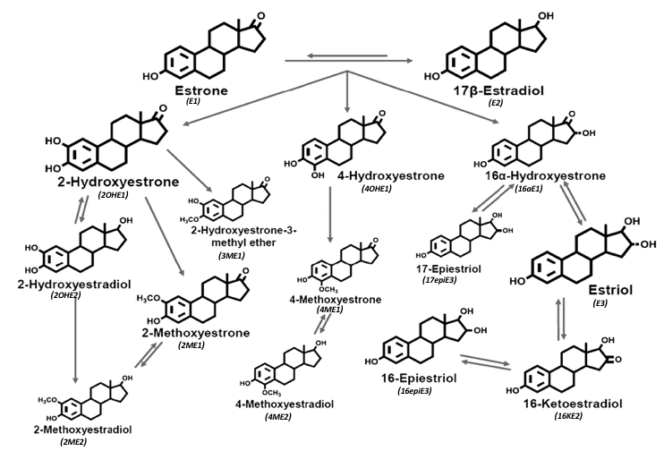
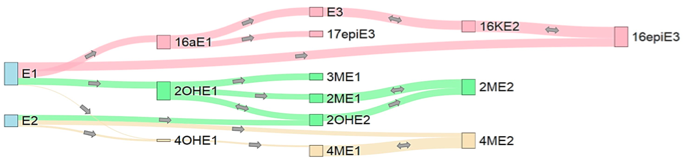
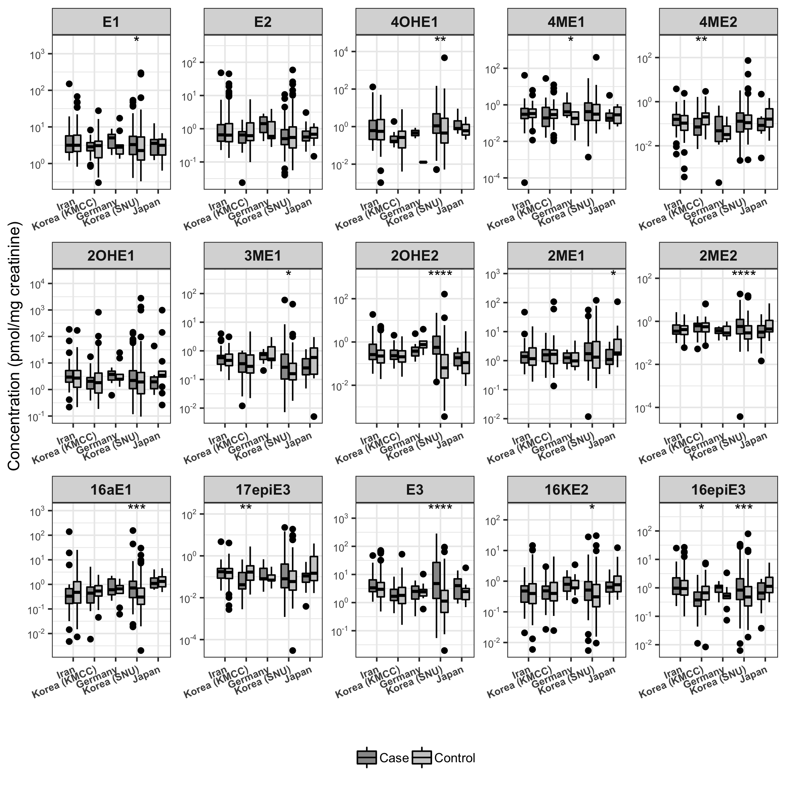

```{r setup, include=FALSE}
library(knitr)
knitr::opts_chunk$set(
	fig.path='figure/graphics-', cache.path='cache/graphics-', # sets folder for saving graphics
    fig.align='center',external=TRUE, warning=FALSE, # alligns figures to center, no print warnings
    fig.pos='H', table.placement='H', fig.height=12.5,  # makes tables and graphs in correct order with text
		fig.width=15,
	echo=FALSE, message=FALSE, cache=TRUE, #don't print code or messages, saves in cache
	warn.conflicts=F,  # don't print warnings 
	tidy=TRUE,tidy.opts=list(width.cutoff=60)) # makes printing code not run off page
				a4width<- 8.3
				a4height<- 9
```


```{r}
setwd("~/Desktop/nci_summer_project/project")
source("Supplemental/check_packages.R")
source("Supplemental/custom_cormatrix.R")  # use to load correlation matrix function
check_packages(c("ggthemes","optimx","metafor","stringr","Hmisc","ggpubr","scales","readxl","sas7bdat","readstata13","gridExtra","RColorBrewer","sjPlot","readr","stargazer","knitr", "grid","lme4","ggrepel","tidyr","networkD3","kableExtra","dplyr","ggplot2"))
load("data/cleaned_data.RDA")
```

\newpage

# Materials and Methods
## Study Design
```{r}
table = as.data.frame(read_xlsx("Supplemental/study_demographics_chart/demographics_read_in.xlsx"))
colnames(table) = c("",rep(c("Case","Control"),6))


kable(table, "latex", caption = "Demographics Table", booktabs = T) %>%
kable_styling(latex_options = c("scale_down","hold_position"),
	bootstrap_options = "condensed", full_width = F, position="center") %>%
  add_header_above(c(" ", "Iran" = 2, "Korea (KMCC)" = 2, "Germany" = 2,"Korea (SNU)"=2,"Japan"=2,"Overall"=2)) %>%
  add_header_above(c(" ", "Cohort" = 6, "Case Control" = 4," "=2)) %>%	
	footnote(c("NA = Data not available"))

#
```

Incident gastric cancer and two case-control studies of early-stage cancer were used for analysis. For the incident gastric cancer set, pre-diagnostic urine samples from all available postmenopausal (or age 60+ years) women diagnosed with gastric cancer and incidence-density matched controls from three prospective cohort studies (Golestan Cohort (Iran), Korean Multicenter Cancer Cohort, and ESTHER Cohort (Germany)) were tested. For the early-stage case-control gastric cancer set, urine samples from postmenopausal (or age 60+ years) women diagnosed with early-stage gastric cancer (AJCC clinical stages 1A [T1, N0, M0] or 1B [T1, N1, M0 or T2, N0, M0]) and 1:1 age-matched (+/- 5 years) controls from established case-control studies in Japan and Korea (Seoul Gastric Cancer Study) were tested. 

Postmenopausal women with gastric cancer were matched by age to gastric cancer-free controls. Women who ever used post-menopausal hormone replacement were excluded since we were specifically interested in the effects of endogenous estrogens. Premenopausal women were also excluded since estrogen levels vary over the menstrual cycle, greatly complicating interpretation of measurements; in any case, gastric cancer is rare prior to age 50 years. On the other hand, restriction of the case-control set to stage 1 gastric cancer will limit the risk of reverse causality.

Urine specimens were collected at enrollment in prospective studies and pre-treatment in case-control studies and continuously cryopreserved at -70/-80 degrees Celcius until analysis.

## Laboratory Assay
Stable isotope dilution liquid chromatography-tandem mass spectrometry (LC-TMS) was used at the NCI Laboratory of Proteomics and Analytical Technologies, MD to simultaneously measure the total concentration of 2 parent estrogens (estrone and estradiol) and 13 estrogen metabolites (2-hydroxyestrone, 2-methoxyestrone, 2-hydroxyestradiol, 2-methoxyestradiol, 2-hydroxyestrone-3-methyl ether, 4-hydroxyestrone, 4-methoxyestrone, 4-methoxyestradiol, 16$\alpha$-hydroxyestrone, 16-ketoestradiol, estriol, 17-epiestriol, and 16-epiestriol) in an aliquot of 500 $\mu$L urine assay for each participant. In urine, parent estrogens and their metabolites are present primarily in conjugated form. Estrogen concentrations in spot urine samples were normalized to creatinine levels in order to adjust for variation in urinary volume. 


# Covarying Relationships Between Metabolites

```{r,out.height = "250px", fig.cap="Estrogen Metabolite Hydroxylation Pathway Diagram"}

```

```{r, fig.cap="Metabolite correlations bewteen direct relationships on hydroxylation group pathway. Line thickness proportional to spearman correlations between substrates and products on hydroxylation pathways (2-OH, green; 4-OH, tan; 16-OH, pink), ranging from 0.01 to 0.62."}

```

Correlations between metabolites were relatively equal throughout the pathways except for the 4-Hydroxylation pathway connection with the 4OHE1 metabolite. The 16-Hydroxylation group showed slightly stronger correlations than the other hydroxylation groups.

```{r, fig.height=12.5, fig.cap="Metabolite correlation matrix. Redder regions indicate stronger positive spearman correlations while bluer indicate stronger inverse spearmaan correlations. Scatterplot and histogram on log scale."}
custom_cormatrix(df %>% select(estrogen_names),log.transform=TRUE,size=0.8)

```

The relationship between estrogen metabolites were computed using spearman correlations on log transformed concentrations. Spearman correlation was chosen to account for nonlinear relationships among the metabolites that are more resistant to outliers and influential points. Log transformations were used to better visualize the paired scatterplots due to highly skewed distributions. 

The histograms show that the estrogen metabolite concentration distributions were still highly right tail skewed even after log transformations. The correlation matrix shows that all estrogens were positively associated with each other, even after adjusting for bonferonni corrections of significance levels. The strongest correlation was among parent estrogens E1 and E2, which was expected. The lowess smooth curve regression line with span 2/3 (in dark blue on the scatterplot) shows that on the log scale, there did not appear to be any major nonlinear higher order interactions (i.e. relationships were mostly linear on the log scale).


# Metabolite and Creatinine Missing Data
```{r,results='asis'}

# view number of missing data
missing = sapply(df %>% select(estrogen_names, creatinine), function(x) sum(is.na(x))) %>% as.data.frame()
missing$variable = rownames(missing)
missing = missing %>% dplyr::rename(num_missing = ".") %>%
mutate(pct_missing = round(num_missing/nrow(missing), 1)) %>%
select(variable, num_missing, pct_missing) %>% 
	rename('Missing (n)' = num_missing, 'Missing (%)' = pct_missing, Estrogen = 'variable')
stargazer(missing, title = "Table of missing values for metabolites and creatinine", header = FALSE,
rownames = FALSE, type = "latex", single.row = TRUE, no.space = TRUE,
summary = FALSE, table.placement = "H")

```

The average percent missing values for estrogen metabolites was about 3%, with 4OHE1 having the highest percentage of missing values. Missing values for metabolites were caused by mis-alignment of co-eluding peaks of the LC-TMS device, which could not be fully amended even after correction. The missing values were not imputed due to the unknown relationship mis-measurement of the LC-TMS device had with the probability of of a measurement to be un-recorded. In other words, it could not be determined if the distribution of missingness was independent of laboratory procedures. All estrogen batches were re-run to compare non-overlapping missing values, which determined that missingness did not appear to be correlated with how high or low the concentrations were. Thus, the standard approach of replacing all missing values with half lower limit of quantification (LLOQ) or lower limit of detection (LOD) would be inappropriate. Since missingness was determined to be independent of measured variables, complete cases (i.e. removing all missing values) was used. It should be noted that results that are borderline significant at the $\alpha$=0.05 level may change if missing values were treated differently instead.


# Quality Control (QC) Analysis

Laboratory personnel was blinded to the case-control status of sample donors. A quality control (QC) set of 20 masked duplicate samples plus 4 additional laboratory control replicates from subjects with high available volumes representative of all studies was performed. Coefficient of variation (CV) and intraclass correlation coefficient (ICC) was calculated for log-transformed standardized estrogen metabolite and creatinine concentrations for the QC samples to assess within- and between-batch variations for assay reliability. Estrogen concentrations were log transformed to improve normality of distributions to meet assumptions necessary for the computation of variance and mean. A constant of 1 was added to concentrations before log transformations to ensure all measurements were positive values. The formula used to calculate ICC was $ICC = \frac{\sigma^2_{bs}}{\sigma^2_{bs}+\sigma_{bb}+\sigma^2_{ws}}$ and the formula for the computation of CV was $CV = \frac{\sigma^2_{ws}+\sigma^2_{bb}}{\mu}$; where $\sigma^2_{bs}$ = variance between subject, $\sigma^2_{bb}$ = variance between batch, and $\sigma^2_{ws}$ = variance within subject. The variance components were computed using a two stage multilevel model with varying intercept for ID and batch. The lower limit of quantitation for each analyte was 0.04 ng/mL.


## Laboratory Control QC Samples
```{r,results='asis'}
control.qc <- read_csv("data/qc_data/control.qc.csv") %>% 
	as.data.frame() %>%   
	# assigns qc labels to ids
	mutate(ID = c("A","D","A","D", # batch 1
                    "B","B","D","D", # batch 2
                    "E","B","B","E", # batch 3
                    "D","E","E","D",  # batch 4
                    "E","E","B","B", # batch 5
                    "B","D","B","D", # batch 6
                    "A","A","B","B", # batch 7 (batch 8 is duplicated)
                    "B","B","E","E",  # batch 9
		            "E","E","D","D", # batch 10
		            "D","D","B","B", # batch 11
 					"B","B","A","A", # batch 12
 					"B","B","E","E", # batch 13
					"E","E","D","D", # batch 14
 					"D","D","B","B", # batch 15
 					"B","B","A","A")) # batch 16

# divides estrogen by creatinine
control.qc[,estrogen_names] = sweep(control.qc[,estrogen_names],control.qc[,"creatinine"],MARGIN=1,"/")  

qc.df = control.qc %>%
  gather(Estrogen,Concentration,estrogen_names) %>%
  mutate(batch.num = as.factor(batch.num), ID = as.factor(ID),
  	Concentration = log(Concentration+1)) %>% 
  group_by(Estrogen)


qc.stats = qc.df %>% 
	# between subject variance
  summarize(s2_between_subject = VarCorr(lmer(Concentration ~ 1+ (1|ID) + (1|batch.num)))$ID[1],  
  	# between batch variance
            s2_between_batch = VarCorr(lmer(Concentration ~ 1+ (1|ID) + (1|batch.num)))$batch.num[1] ,   
  	# within subject variance
            s2_within_subject = (attr(VarCorr(lmer(Concentration ~ 1+ (1|ID) + (1|batch.num))), "sc"))^2 ,  
  	# mean
            mean_concentration = mean(Concentration,na.rm=TRUE)) %>%
	# computes ICC
  mutate( 'ICC (%)' = round(  100*(s2_between_subject/(s2_between_subject+s2_within_subject+s2_between_batch)), 1) ,
  	# computes CV
          'CV (%)' = round( 100*(sqrt(s2_within_subject + s2_between_batch)/mean_concentration),1)) %>%
			arrange(factor(Estrogen,levels=estrogen_names))

stargazer(qc.stats %>% mutate(s2_between_subject = round(s2_between_subject,2),
                                s2_between_batch = round(s2_between_batch,2),
                                s2_within_subject = round(s2_within_subject,2),
                                mean_concentration = round(mean_concentration,2))%>%
		arrange(factor(Estrogen,levels=estrogen_names))
	, title = "Laboratory control samples QC calculations", header=FALSE, type='latex',single.row=TRUE, no.space=TRUE, rownames=FALSE,summary=FALSE, covariate.labels=c("Estrogen","$\\sigma^2_{bs}$","$\\sigma^2_{bb}$","$\\sigma^2_{ws}$","Mean"), table.placement = 'H', notes="Note: bs = between subject, bb = between batch, ws = within subject")

qc.stats2 = qc.stats %>% select(Estrogen,'CV (%)', 'ICC (%)') %>% rename(cv = 'CV (%)', icc = 'ICC (%)')

```

```{r, fig.height=2.5, fig.cap="Distribution of CV and ICC for all metabolites for laboratory control QC samples"}
ggplot(qc.stats2 %>% rename(CV = cv, ICC = icc) %>% gather(var1,var2,c(ICC,CV)), aes(var2))+
	geom_density(fill="grey75")+
    scale_x_continuous("",breaks=seq(0,200,25))+
	theme_classic()+
		facet_wrap(~var1,ncol=2,nrow=1,scales="free")+
	theme(axis.text.y=element_blank(),axis.ticks.y=element_blank(),
    	strip.text.x = element_text(size = 15,face="bold"), 
    	axis.text.x =  element_text(size=15,face="bold"))

```

```{r, fig.height=10, fig.cap="Four laboratory control QC sample IDs (x-axis) plotted against measured standardized concentrations. Batch identification indicated by color and shape."}
ggplot(qc.df %>% group_by() %>%mutate(Estrogen = factor(as.factor(Estrogen), levels=estrogen_names)),aes(x=ID,y=Concentration)) +
		stat_boxplot(geom ='errorbar',alpha=0.5) + 
  geom_boxplot(color="grey90",outlier.shape = NA,alpha=0.5)+
  geom_jitter(aes(color=batch.num,shape=batch.num),size=3,alpha=0.9, width=0.2,height=0,show_guide = TRUE) +
  scale_shape_manual(values=1:nlevels(qc.df$batch.num))+
  theme_classic() +  
 geom_vline(data = data.frame(Estrogen= sort(rep(unique(qc.df$Estrogen),length(unique(qc.df$ID)))), id.num=rep(1:length(unique(qc.df$ID)),length(unique(qc.df$Estrogen)))),
             aes(xintercept=id.num),color="grey50",linetype="dotted")+
  scale_y_log10("Estrogen concentration (pmol/mg creatinine)")	+
  xlab("ID") + 
  facet_wrap(~ Estrogen,scales="free",ncol=5) +
  theme(legend.position="none",strip.text.x = element_text(size =15,face="bold"), 
  	    axis.text.x=element_blank(),
        axis.text.y =  element_text(size=12.5, face="bold"))
```


The laboratory control QC samples consisted of 4 distinct urine sample types: 2 pre-menopausal (n=8 and 16), 1 post-menopausal (n=22), and 1 male urine (n=14), totaling 60 observations. In order to assess within and between variation, four samples were allocated within in each batch, some of which had duplicate sample types in the same batch.

Most metabolites had ICCs $\geq$ 75% with most CVs $\leq$ 50%, indicating moderate reproducibility generalizable across all batches. The QC samples plotted on the log scale illustrated that a few measurements for the same sample were many fold different than their counterparts. Two batches were specifically problematic, often having measurments many fold higher than other batches across different estrogens. Concentrations of these batches were not adjusted downwards since the sample size of QC samples in these batches were not sufficient enough for justification. Within subject variation was so significant that when concentrations were classified into tertiles, many replicates were in different tertile categories. 

### Korea SNU Duplicate QC Samples
```{r,results='asis'}
snu.qc = read_csv("data/qc_data/snu.qc.csv") %>% 
	as.data.frame() %>% arrange(customer.id)

# divides estrogen by creatinine
snu.qc[,estrogen_names] = sweep(snu.qc[,estrogen_names],snu.qc[,"creatinine"],MARGIN=1,"/")  

qc.df = snu.qc %>%
  rename(ID = customer.id) %>%
  gather(Estrogen,Concentration,estrogen_names) %>%
  mutate(batch.num = as.factor(batch.num), ID = as.factor(ID),
  	Concentration = log(Concentration+1)) %>% 
  group_by(Estrogen)

qc.stats = qc.df %>% 
	# between subject variance
  summarize(s2_between_subject = VarCorr(lmer(Concentration ~ 1+ (1|ID) + (1|batch.num)))$ID[1],  
  	# between batch variance
            s2_between_batch = VarCorr(lmer(Concentration ~ 1+ (1|ID) + (1|batch.num)))$batch.num[1] ,   
  	# within subject variance
            s2_within_subject = (attr(VarCorr(lmer(Concentration ~ 1+ (1|ID) + (1|batch.num))), "sc"))^2 ,  
  	# mean
            mean_concentration = mean(Concentration,na.rm=TRUE)) %>%
	# computes ICC
  mutate( 'ICC (%)' = round(  100*(s2_between_subject/(s2_between_subject+s2_within_subject+s2_between_batch)), 1) ,
  	# computes CV
          'CV (%)' = round( 100*(sqrt(s2_within_subject + s2_between_batch)/mean_concentration),1)) %>%
			arrange(factor(Estrogen,levels=estrogen_names))


stargazer(qc.stats %>% mutate(s2_between_subject = round(s2_between_subject,2),
                                s2_between_batch = round(s2_between_batch,2),
                                s2_within_subject = round(s2_within_subject,2),
                                mean_concentration = round(mean_concentration,2))%>%
		arrange(factor(Estrogen,levels=estrogen_names))
	, title = "Korea SNU replicates QC calculations", header=FALSE, type='latex',single.row=TRUE, no.space=TRUE, rownames=FALSE,summary=FALSE, covariate.labels=c("Estrogen","$\\sigma^2_{bs}$","$\\sigma^2_{bb}$","$\\sigma^2_{ws}$","Mean"), table.placement = 'H', notes="Note: bs = between subject, bb = between batch, ws = within subject")

qc.stats2 = qc.stats %>% select(Estrogen,'CV (%)', 'ICC (%)') %>% rename(cv = 'CV (%)', icc = 'ICC (%)')
```

```{r, fig.height=2.5, fig.cap="Distribution of CV and ICC for all metabolites for Korea SNU QC samples"}
ggplot(qc.stats2 %>% rename(CV = cv, ICC = icc) %>% gather(var1,var2,c(ICC,CV)), aes(var2))+
	geom_density(fill="grey75")+
    scale_x_continuous("",breaks=seq(0,200,25))+
	theme_classic()+
	theme(axis.text.y=element_blank(),axis.ticks.y=element_blank(),
		   	strip.text.x = element_text(size = 15,face="bold"), 
    	axis.text.x =  element_text(size=15,face="bold"))+
	facet_wrap(~var1,ncol=2,nrow=1,scales="free")
```

```{r, fig.height=10, fig.cap="19 Korea SNU QC sample IDs (x-axis) plotted against measured standardized concentrations. Batch identification indicated by color and shape."}
ggplot(qc.df %>% group_by() %>%mutate(Estrogen = factor(as.factor(Estrogen), levels=estrogen_names)),aes(x=ID,y=Concentration)) +
  geom_jitter(aes(color=batch.num,shape=batch.num),size=3,alpha=0.9, width=0.2,height=0,show_guide = TRUE) +
  scale_shape_manual(values=1:nlevels(qc.df$batch.num))+
  theme_classic() +  
 geom_vline(data = data.frame(Estrogen= sort(rep(unique(qc.df$Estrogen),length(unique(qc.df$ID)))), id.num=rep(1:length(unique(qc.df$ID)),length(unique(qc.df$Estrogen)))),
             aes(xintercept=id.num),color="grey50",linetype="dotted")+
  scale_y_log10("Estrogen concentration (pmol/mg creatinine)")	+
  xlab("ID") + 
  facet_wrap(~ Estrogen,scales="free",ncol=5) +
  theme(legend.position="none",strip.text.x = element_text(size =15,face="bold"), 
  	    axis.text.x=element_blank(),
        axis.text.y =  element_text(size=12.5, face="bold"))

```


The Korea SNU replicates consisted of 19 unique samples each with two measurements, totaling 38 observations. Most metabolites had ICCs $\geq$ 50% with most CVs $\leq$ 60%, indicating moderately inconsistent measurements. Replication results for Korea SNU duplicates was worse than over all batches assessed with laboratory control samples. Many measurements for the same sample were many fold different than their counterparts. Thus, it should be noted that metabolite measurements for Korea SNU may not be reproducible and caution is advised.


# Associations with Gastric Cancer


```{r,fig.cap="Study specific Wilcoxon-Mann-Whitney tests for cases vs. controls"}
###################################
boxplot.df = df %>% select(estrogen_names, origin,status) %>% filter(!(is.na(status))) %>%
  gather(Estrogen,Concentration,1:15)%>% 
  mutate(Estrogen = factor(as.factor(Estrogen),levels = estrogen_names),status=as.factor(status),
  	origin = factor(as.factor(origin),levels=country_list))

estrogen_max = boxplot.df %>% group_by(Estrogen) %>% summarize(max = max(Concentration,na.rm=TRUE)) %>% 
  mutate(Estrogen = factor(as.factor(Estrogen), levels=estrogen_names))

blank = data.frame(Estrogen = rep(estrogen_max$Estrogen,2), x=0,y=c(0-estrogen_max$max/15,7*estrogen_max$max)) %>% arrange(Estrogen)

boxplot.output = ggplot(boxplot.df, aes(x=origin,y=Concentration, fill=status)) +
  geom_boxplot(color="black") +
		scale_fill_grey(start=0.6)+
	  scale_y_log10(breaks = scales::trans_breaks("log10", function(x) 10^x),labels = scales::trans_format("log10", scales::math_format(10^.x))) +
  theme_bw() +
	facet_wrap(~ Estrogen, scales="free",ncol=5) +
  stat_compare_means(aes(group = status), method="wilcox.test", label= "p.signif",hide.ns=TRUE) +
  xlab("")+
  ylab("Concentration (pmol/mg creatinine)")+
	  geom_blank(data = blank, aes(x = x, y = y,fill=NULL))+
    theme(
    	strip.text.x = element_text(size = 10,face="bold"), 
    	axis.text.x =  element_text(size=7,face="bold",angle=23,hjust=1), 
    	axis.text.y =  element_text(size=7,face="bold"), 
    	legend.title=element_blank(),
    	legend.position="bottom")

ggsave(file.path("Graphs and Tables", "boxplot.output.png"),
             boxplot.output, width=7.5, height=7.5)


```

Postmenopausal women with gastric cancer was compared with controls for both pre-diagnostic and early-stage case-control sample sets. Each study was analyzed seperately to account for differences in the relationship between estrogens and gastric cancer by country of origin and study type. Each of the estrogen markers were separately analyzed to assess an association with gastric cancer. Wilcoxon-Mann-Whitney (also known as Mann-Whitney U) test was used to compare estrogen marker concentrations as a continuous value between cases and controls. Significance levels are indicated by stars above boxplots ($*: p\leq0.05, **: p\leq0.01, ***: p\leq0.001, ****: p\leq0.0001$). According to the boxplot comparisons, over half of the metabolites had cases that had significantly higher concentrations for cases than controls at the $\alpha$=0.05 level for Korea SNU. However, the three metabolites that were significant for Korea KMCC (4ME2, 17epiE3, 16epiE3) showed the opposite association (i.e. controls had significantly higher levels of these metabolites compared to cases).  


```{r,results='asis'}
table = list()
for (i in 1:length(country_list)){
table[[i]] = df %>% filter(status=="Control") %>% select(origin,estrogen_names) %>% 
	gather(Estrogen,Concentration,estrogen_names) %>% 
	filter(origin==country_list[i])%>%
	group_by(origin,Estrogen) %>%
	summarize(var1 = paste0(round(median(Concentration,na.rm=TRUE),2), " (",
		round(quantile(Concentration, probs=1/3, na.rm=TRUE, names=FALSE),2),", ",
		round(quantile(Concentration, probs=2/3, na.rm=TRUE, names=FALSE),2),
		")")) %>%
	arrange(factor(origin, levels = country_list))
		
}
table = bind_cols(table) %>% group_by()%>%
	select(-contains("origin")) %>% arrange(factor(Estrogen,levels=estrogen_names)) %>%
	select(-contains("Estrogen"))

rownames(table) = estrogen_names_long
colnames(table) = rep("Median (Tertile)",5)


kable(table, "latex", caption = "Estrogen concentration median and tertile cutpoint", booktabs = T) %>%
	add_header_above(c("","Iran", "Korea (KMCC)","Germany","Korea (SNU)","Japan")) %>%
  add_header_above(c(" ", "Cohort" = 3, "Case Control" = 2)) %>%
kable_styling(latex_options = c("scale_down","hold_position")) %>%
	footnote(c("Tertile (33% and 66% quantiles) determined by control subjects","Units in pmol/mg creatinine"))
```

Study-specific estrogen marker tertiles were defined by the concentration distribution in controls to account for the extremely skewed distributions and improve interpretability. Tertile categories were treated as a numeric entry rather than a factor type to assess overall linear associations (i.e. $\beta$ coefficient for metabolite markers interpreted as risk difference from one tertile to the next) Changing the number of quantiles did not significantly affect results (i.e. splitting concentrations into quartiles or quintiles did not change linear associations by much). Korea SNU appeared to have lower estrogen concentrations than other studies, especially for the metabolites with high concentrations (E1, 2OHE1, E3). 

```{r,fig.height=5,fig.width=5}
# model1= list()
# for (j in 1:5){  
# country.df = df %>% filter(origin==country_list[j]) %>% select(origin,case,t.estrogen_names,age,bmi,alcohol,smoking,relativegc,education)  
# model1[[j]] = data.frame(origin=country_list[j],estrogen = c(estrogen_names),estimate=rep(NA,15), variance=rep(NA,15), lower = rep(NA,15), upper = rep(NA,15))
# 
# if (j==3){ range=c(1,2,4:15)} else{ range=1:15  }
# 
#  for (k in range){
#  model = summary(glm(as.formula(paste0("case", " ~ ", (paste(t.estrogen_names[k], "age",sep="+")))), data=country.df,  family=binomial(link="logit")))$coef
#  model1[[j]]$estimate[k] = model[2,1]
#  model1[[j]]$variance[k] = (model[2,2])^2
#  model1[[j]]$lower[k] = model[2,1]-1.96*model[2,2]
#  model1[[j]]$upper[k] = model[2,1]+1.96*model[2,2]
#  }
# }
# model1 = bind_rows(model1) %>% mutate(variance = ifelse(variance>1000,NA,variance))
# 
# 
# meta.model1 = data.frame(origin="Random Effect",estrogen = estrogen_names,estimate=rep(NA,15), variance=rep(NA,15),lower = rep(NA,15), upper = rep(NA,15))
# #par(mar=c(1,1,1,1))
# #par(mfrow = c(3, 5))
# for (i in 1:15){
# data = model1 %>%filter(estrogen==estrogen_names[i])
# model = rma(yi=data$estimate,vi=data$variance,method="REML")   # random effect model meta analysis
# meta.model1$estimate[i] = model$beta
# meta.model1$variance[i] = (model$se)^2
# meta.model1$lower[i] = model$ci.lb
# meta.model1$upper[i] = model$ci.ub
# #forest(model,atransf=exp, slab=country_list,psize=0.9,xlab=estrogen_names[i],at=log(c(.25,1,2,5)), xlim=c(-1,5), cex=.9)
# }
# #par(mfrow = c(1, 1))


##################################

```


```{r,fig.height=5,fig.width=5, fig.cap="Forestplot of fully adjusted pooled random effect meta-analysis logistic regression model"}
model3= list()
for (j in 1:5){ 
country.df= df %>% filter(origin==country_list[j]) %>% select(origin,case,t.estrogen_names,age,bmi,alcohol,smoking,relativegc,education)
model3[[j]] = data.frame(origin=country_list[j],estrogen = c(estrogen_names),estimate=rep(NA,15), variance=rep(NA,15), lower = rep(NA,15), upper = rep(NA,15))


if (j==3){ # for germany
 for (k in c(1,2,4:15)){
  model = summary(glm(as.formula(paste0("case", " ~ ", (paste(t.estrogen_names[k], "age","bmi", sep="+")))), data=country.df,  family=binomial(link="logit")))$coef
  
  model3[[j]]$estimate[k] = model[2,1]
 model3[[j]]$variance[k] = (model[2,2])^2
 model3[[j]]$lower[k] = model[2,1]-1.96*model[2,2]
 model3[[j]]$upper[k] = model[2,1]+1.96*model[2,2]
 }
  } else if (j==5){ # for japan
  for (k in 1:15){
  model = summary(glm(as.formula(paste0("case", " ~ ", (paste(t.estrogen_names[k], "age","bmi","relativegc", sep="+")))), data=country.df,  family=binomial(link="logit")))$coef
  
   model3[[j]]$estimate[k] = model[2,1]
 model3[[j]]$variance[k] = (model[2,2])^2
 model3[[j]]$lower[k] = model[2,1]-1.96*model[2,2]
 model3[[j]]$upper[k] = model[2,1]+1.96*model[2,2]
  }
 } else if (j==2){ # for korea (KMCC)
  for (k in 1:15){
  model = summary(glm(as.formula(paste0("case", " ~ ", (paste(t.estrogen_names[k], "age","smoking","bmi","education", sep="+")))), data=country.df,  family=binomial(link="logit")))$coef
  
   model3[[j]]$estimate[k] = model[2,1]
 model3[[j]]$variance[k] = (model[2,2])^2
 model3[[j]]$lower[k] = model[2,1]-1.96*model[2,2]
 model3[[j]]$upper[k] = model[2,1]+1.96*model[2,2]
  }
 } else if (j==1){ # for iran
  for (k in 1:15){
  model = summary(glm(as.formula(paste0("case", " ~ ", (paste(t.estrogen_names[k], "age","bmi","education", sep="+")))), data=country.df,  family=binomial(link="logit")))$coef
 
   model3[[j]]$estimate[k] = model[2,1]
 model3[[j]]$variance[k] = (model[2,2])^2
 model3[[j]]$lower[k] = model[2,1]-1.96*model[2,2]
 model3[[j]]$upper[k] = model[2,1]+1.96*model[2,2]
   }
 } else if (j==4){ # for korea snu
  for (k in 1:15){
  model = summary(glm(as.formula(paste0("case", " ~ ", (paste(t.estrogen_names[k], "age","smoking","bmi","education","relativegc", sep="+")))), data=country.df,  family=binomial(link="logit")))$coef
  
   model3[[j]]$estimate[k] = model[2,1]
 model3[[j]]$variance[k] = (model[2,2])^2
 model3[[j]]$lower[k] = model[2,1]-1.96*model[2,2]
 model3[[j]]$upper[k] = model[2,1]+1.96*model[2,2]
  }
 }
 }
model3 = bind_rows(model3) %>% mutate(variance = ifelse(variance>1000,NA,variance))


meta.model3 = data.frame(origin="Overall Random Effect",estrogen = estrogen_names,estimate=rep(NA,15), variance=rep(NA,15),lower = rep(NA,15), upper = rep(NA,15))

#par(mar=c(1,1,1,1))
#par(mfrow = c(3, 5))
for (i in 1:15){
data = model3 %>%filter(estrogen==estrogen_names[i])
model = rma(yi=data$estimate,vi=data$variance,method="REML")   # random effect model meta analysis
meta.model3$estimate[i] = model$beta
meta.model3$variance[i] = (model$se)^2
meta.model3$lower[i] = model$ci.lb
meta.model3$upper[i] = model$ci.ub
#forest(model,atransf=exp, slab=country_list,psize=0.9,xlab=estrogen_names[i],at=log(c(.25,1,2,5)), xlim=c(-1,5), cex=.9)
}

meta.model3[,3:6] = sapply(meta.model3[,3:6], exp) %>% as.data.frame()

ggplot(meta.model3 %>% mutate(estrogen = factor(estrogen,levels=rev(estrogen_names))), aes(x = estrogen,y = estimate))+
    geom_pointrange(aes(ymin = lower, ymax = upper),size=0.5) +
    geom_errorbar(aes(ymin=lower, ymax=upper),width=0.25,cex=0.5)+   
    ylab("Odds Ratio (95% CI)") +
    scale_y_log10(breaks = c(0.25,0.5,1,1.5,2,3,5), labels=c(0.25,0.5,1,1.5,2,3,5))+
	theme_bw() +
    geom_hline(aes(fill=model),yintercept =1, linetype="dotted",size=1)+
    xlab("")+
    theme(axis.text.y=element_text(face="bold",size=12.5),
          axis.text.x=element_text(face="bold",size=12.5))+
    coord_flip()

```

# Iraon = age +  bmi, education
# korea (KMCC) = age, bmi, smoking, education
# Germany = age, bmi
# Korea (SNU) = age, bmi, smoking, education, relativegc
# Japan = age, bmi, relativegc 

Multivariate logistic model used for each study:

* Iran: $log(\frac{\pi}{1-\pi}) = \beta_0 + \beta_1E_i + \beta_2X_1 + \beta_3X_2 + \beta_4X_3$ 

* Korea (KMCC): $log(\frac{\pi}{1-\pi}) = \beta_0 + \beta_1E_i + \beta_2X_1 + \beta_3X_2 + \beta_4X_3 + \beta_5X_4$ 

* Germany: $log(\frac{\pi}{1-\pi}) = \beta_0 + \beta_1E_i + \beta_2X_1 + \beta_3X_2$ 

* Korea (SNU):  $log(\frac{\pi}{1-\pi}) = \beta_0 + \beta_1E_i + \beta_2X_1 + \beta_3X_2 + \beta_4X_3 + \beta_5X_4 + \beta_6X_5$ 

* Japan: $log(\frac{\pi}{1-\pi}) = \beta_0 + \beta_1E_i + \beta_2X_1 + \beta_3X_2 + \beta_4X_5$ 

Where $\pi = Pr(Y=1|E,X)$, $E_i$ = metabolites 1-15 as numeric tertile entries, $X_1$ = age (years), $X_2$ = BMI, $X_3$ = any educational degree, $X_4$ = ever smoked, and $X_5$ = relative with gastric cancer.   

```{r}
# Iraon = age +  bmi, education
# korea (KMCC) = age, bmi, smoking, education
# Germany = age, bmi
# Korea (SNU) = age, bmi, smoking, education, relativegc
# Japan = age, bmi, relativegc
```

# Additional Analysis

```{r,out.height = "250px", fig.cap="Estrogen Metabolite Hydroxylation Pathway Diagram"}
knitr::include_graphics('Graphs and Tables/compare_estrogens_to_studies.png')
```
Standardized estrogen concentrations agreed with Moore et al., 2016 and Sampson et al., 2016 which used similar datasets of the same demographis (Comparison table found in Other Analysis section below).


```{r,fig.cap="Pooled Wilcoxon-Mann-Whitney tests for cases vs. controls"}
boxplot.df = df %>% select(estrogen_names,status) %>% gather(estrogen,value,estrogen_names) %>%
		mutate(estrogen = factor(as.factor(estrogen),levels=rev(estrogen_names)),
			status = factor(as.factor(status), levels=c("Case","Control"))) %>%
	filter(!(is.na(status)))

blank = data.frame(x=0,y=c(10e-5,7*max(boxplot.df$value,na.rm=TRUE)))

ggplot(boxplot.df,aes(estrogen,value))+
		geom_boxplot(color="black",aes(fill=status))+
		scale_fill_grey(start=0.6)+
scale_y_log10("Concentration (pmol/mg creatinine)",breaks = scales::trans_breaks("log10", function(x) 10^x),labels = scales::trans_format("log10", scales::math_format(10^.x))) +
	theme_bw()+
	xlab("")+
	coord_flip()+
	geom_blank(data = blank, aes(x = x, y = y,fill=NULL))+
	stat_compare_means(aes(group = status), method="wilcox.test", label= "p.signif",hide.ns=TRUE)+
	theme(legend.position=c(0.88,0.1),
		  legend.title=element_blank(),
		 axis.text.x =  element_text(size=10,face="bold"),
    	axis.text.y =  element_text(size=10,face="bold"))

```


